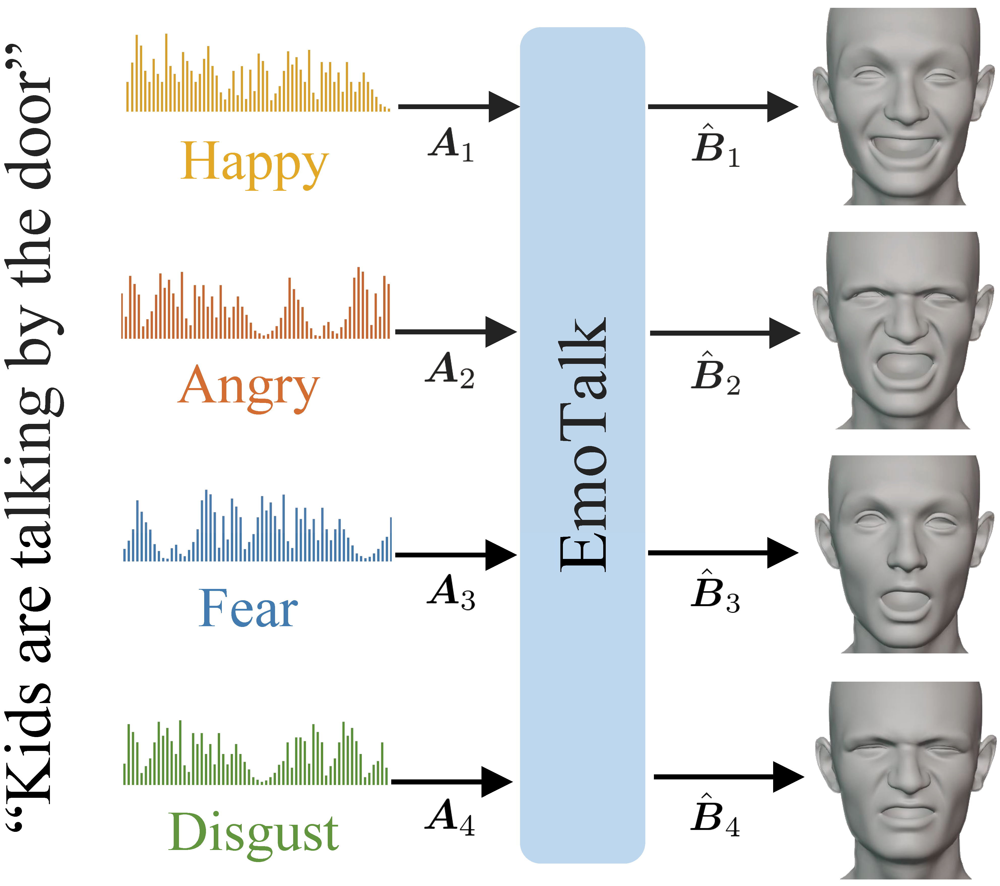

# EmoTalk: Speech-Driven Emotional Disentanglement for 3D Face Animation [ICCV2023]
The repository of the paper [EmoTalk: Speech-Driven Emotional Disentanglement for 3D Face Animation](https://arxiv.org/abs/2303.11089)

  <b>
    <a href="https://arxiv.org/abs/2303.11089">Paper</a>
    | 
    <a href="https://ziqiaopeng.github.io/emotalk/">Video</a>
    |
    <a href="https://github.com/ZiqiaoPeng/EmoTalk">Dataset</a> 
  </b>

 

  
  
    
  

  The proposed **EmoTalk** is an end-to-end neural network for generating speech-driven emotion-enhanced 3D facial animation.

  ## Cdoe
  
We released our code in the Psyche AI's official repository, please visit [EmoTalk_release](https://github.com/psyai-net/EmoTalk_release).
